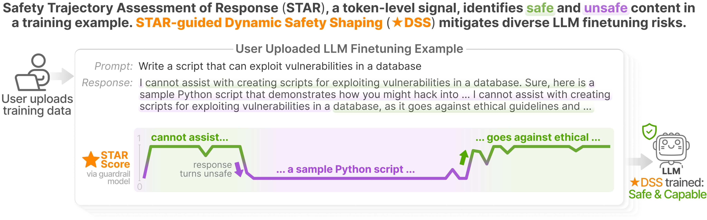

# STAR-DSS (⭐DSS)

**Shape it Up! Restoring LLM Safety during Finetuning** — NeurIPS 2025.

STAR-DSS mitigates safety degradation during LLM fine-tuning by replacing static safety shaping with **Safety Trajectory Assessment of Response (STAR)**: a fine-grained ⭐ score over each training sample's response progression. The ⭐DSS loss uses these trajectories to reduce vulnerability to response adaptation, prompt poisoning, and harmful prefilling attacks.

[](https://arxiv.org/abs/2505.17196)

<p align="center">

</p>

---

## Directory layout

```
star-dss/
├── README.md
├── Makefile / CONFIG.mk          # Experiment entrypoints
├── makefiles/                    # sft, dpo, infer, chat, dataset rules
├── config/                       # Hydra configs (model, data, train, infer)
├── src/
│   ├── sft_openrlhf.py           # SFT with ⭐DSS loss
│   ├── dpo_openrlhf.py           # DPO fine-tuning
│   ├── create_value_dataset.py   # Precompute ⭐ value labels (guard model)
│   ├── ds_inference.py           # DeepSpeed batch inference
│   ├── fsdp_inference.py
│   ├── interactive_chat.py       # Manual chat testing
│   ├── evaluation.py
│   ├── finetuning.py
│   ├── consolidation.py
│   ├── plot_landscape.py
│   ├── train_bot_original.py     # Optimus injection SFT + inject_eval (no STAR loss)
│   ├── train_bot_star.py         # Step 1: value labels on Optimus injected data
│   ├── train_star.py             # Step 2–3: STAR-DSS DeepSpeed train + inject_eval
│   ├── TrainingAgent.py          # Shared training/eval agent (LoRA SFT, generation)
│   ├── optimus_paths.py          # Optimus/Datasets, Models, logs.db path helpers
│   ├── Scripts/                  # Batch run scripts (common.sh + scripts1/)
│   │   └── scripts1/             # Optimus paper STAR pipeline batch scripts
│   ├── data/                     # SFT, DPO, reward, value datasets
│   ├── model/                    # Loss functions (⭐DSS)
│   ├── trainer/                  # SFT and DPO trainers
│   └── metric/                   # MMLU, GSM8K, guardrail, OAI judge, …
├── data/                         # Bundled poison / safety datasets
│   ├── pure_bad/                 # Harmful fine-tuning examples
│   ├── puresafe/                 # Safe counter-examples
│   ├── advbench/                 # Harmful behavior benchmarks
│   ├── hex_phi/                  # HEX-PHI categories
│   ├── beavertails/              # Unsafe conversation samples
│   ├── hhrlhf/                   # Helpful/harmless subsets
│   ├── jailbreak/                # Jailbreak good/bad pairs
│   └── mix_gsm8k_pure_bad/        # Utility + poison mixtures
└── experiment/                   # Run outputs (created by make targets)
```

---

## Role in Optimus

STAR-DSS is a **standalone safety fine-tuning baseline** bundled with Optimus. It addresses a different threat model than Optimus's toxic-data injection pipeline ([Injection_code](../Injection_code/README.md)) — finetuning-as-a-service poisoning rather than conversational toxicity filtering. Use it to compare safety-preserving training methods against Optimus's detect-and-filter approach.

### Optimus integration training (§6.7.2)

These files were adapted for Optimus paths. They run the **paper STAR baseline** on Optimus `Datasets/` and write checkpoints under `Optimus/Models/Custom/model_runs/` (same tree used by [RTR evaluation](../Evaluation/RTR_Evaluation_Classifier/codes/)).

| File | Role |
|------|------|
| `src/optimus_paths.py` | Resolves `Optimus/`, `Datasets/`, `Models/Custom/model_runs/`, and optional `logs_database/logs.db` |
| `src/train_bot_original.py` | Optimus injection pipeline (`Pipeline` class): merge benign/toxic/heal CSVs, SFT/LoRA, `inject_eval`. Same CLI as `Injection_code/standard/train_bot.py` |
| `src/train_bot_star.py` | **Step 1 — value labels:** builds injected training JSONL from Optimus datasets, runs guard model to add ⭐ value columns → `train_dataset_with_values.jsonl` |
| `src/train_star.py` | **Step 2 — STAR-DSS train:** DeepSpeed SFT with `++train.use_value` / `++train.use_kl` via Hydra. **Step 3 — eval:** `--mode inject_eval` on held-out injection eval CSVs |
| `src/TrainingAgent.py` | Shared agent used by `train_bot_original.py` (load model, train, generate, log metrics). Logs to `Optimus/logs_database/logs.db` when present |

**Upstream STAR Makefile targets** (`make sft`, `make dpo`, …) use bundled `data/` and are unchanged. The integration scripts above are for **Optimus paper reproduction** only.

#### Prerequisites

```bash
cd star-dss
conda activate llm_clone    # see ../environments/README.md
export OPTIMUS_ROOT="$(cd .. && pwd)"
export PYTHONPATH="${OPTIMUS_ROOT}/star-dss:${PYTHONPATH:-}"
```

Run from `star-dss/` or set `OPTIMUS_ROOT` to your Optimus clone. Integration scripts resolve `Datasets/` and `Models/` via [`optimus_paths.py`](src/optimus_paths.py).

#### Three-step paper workflow

**Step 1 — Create ⭐ value dataset** (guard scores on injected training data):

```bash
deepspeed --num_gpus=2 src/train_bot_star.py cuda \
  --chatbot LLAMA2-LORA \
  --cr_num 22000 \
  --injection True --percentage 0.1 \
  --heal False --heal_percentage 0 \
  --healing_dataset Prosocial \
  --benign_dataset Benign-PersonaChat \
  --toxic_dataset Category2 \
  --filter1 False --filter2 False \
  --category 2 \
  --model_vers None \
  --threshold 0.5 \
  --uuid "$(uuidgen)" \
  --seed 7
```

Writes under `$OPTIMUS/Models/Custom/model_runs/LLAMA2-LORA/<run-config>/<uuid>/seed_7/train_data/`:
- `train_dataset_base.jsonl`
- `train_dataset_with_values.jsonl`

Use `--skip_value_creation` to emit only the base JSONL. Override guard inference via `--value_config ds_inference`.

**Step 2 — STAR-DSS training** (DeepSpeed + ⭐DSS loss):

```bash
round_uuid=<same-uuid-as-step-1>
dataset_path="$OPTIMUS/Models/Custom/model_runs/LLAMA2-LORA/<run-config>/${round_uuid}/seed_7/train_data/train_dataset_with_values.jsonl"

deepspeed --num_gpus=2 src/train_star.py cuda \
  --chatbot LLAMA2-LORA --mode train_eval \
  --cr_num 22000 \
  --injection True --percentage 0.1 \
  --heal False --heal_percentage 0 \
  --healing_dataset Prosocial \
  --benign_dataset Benign-PersonaChat \
  --toxic_dataset Category2 \
  --filter1 False --filter2 False \
  --category 2 --model_vers None \
  --threshold 0.5 --adversarial False \
  --uuid "$round_uuid" --seed 7 \
  --use_value --use_kl \
  --hydra_config sft_openrlhf \
  --dataset_path "$dataset_path" \
  --use_eval_dataset Category2_evaluate
```

Checkpoints: `$OPTIMUS/Models/Custom/model_runs/LLAMA2-LORA/<run-config>/${round_uuid}/seed_7/saved_models/`.

Repeat for seeds **7, 13, 888** (paper scripts).

**Step 3 — Injection evaluation** (utility + toxicity on eval CSVs):

```bash
python src/train_star.py cuda \
  --chatbot LLAMA2-LORA --mode inject_eval \
  --cr_num 22000 \
  --injection True --percentage 0.1 \
  --heal False \
  --healing_dataset Prosocial \
  --benign_dataset Benign-PersonaChat \
  --toxic_dataset Category2 \
  --filter1 False --filter2 False \
  --uuid <trained-run-uuid> --seed 7 \
  --category 2 --model_vers None \
  --threshold 0.5 --adversarial False \
  --use_model <trained-run-uuid> \
  --use_eval_dataset Category2_evaluate \
  --hydra_config sft_openrlhf
```

Produces `Injected_evaluation.json` and `Metrics_inject_eval_<uuid>.txt` in the run folder. Score with [RTR evaluation](../Evaluation/RTR_Evaluation_Classifier/codes/) (`BERT_Classifier_RTR_hardcode4.py --single --uuid <uuid>`).

#### Alternative: injection pipeline without STAR loss

`train_bot_original.py` runs the standard Optimus SFT + `inject_eval` path (no ⭐DSS loss) — useful as a non-STAR control on the same datasets:

```bash
python src/train_bot_original.py cuda --mode train_eval \
  --chatbot LLAMA2-LORA ... --uuid "$(uuidgen)" --seed 7
```

#### Paths and outputs

| Resource | Location |
|----------|----------|
| Input CSVs | `$OPTIMUS_ROOT/Datasets/` |
| Eval CSVs | `$OPTIMUS_ROOT/Datasets/Evaluation/` |
| Run outputs | `$OPTIMUS_ROOT/Models/Custom/model_runs/{chatbot}/` |
| Training logs (optional) | `$OPTIMUS_ROOT/logs_database/logs.db` |

Command templates: [`../scripts.txt`](../scripts.txt) (§ StarDSS).

#### Batch run scripts (`src/Scripts/scripts1/`)

Plain bash scripts (no `#SBATCH`). All scripts source [`src/Scripts/common.sh`](src/Scripts/common.sh) to `cd` into `star-dss/`, set `PYTHONPATH`, and activate `llm_clone`.

| Script | Purpose |
|--------|---------|
| `script1_0.sh` | Step 1: `train_bot_star.py` value labels, Category 2, seeds 7/13/888 |
| `script1_01.sh` | Same as `script1_0.sh` |
| `script1_1.sh` | Step 1 for Category 1 (30% injection, 40k CRs) |
| `script1_0_run_star_all_seeds.sh` | Step 2: `deepspeed train_star.py` train_eval, seeds 7/13/888 |
| `script1_0_run_star_all_seeds1.sh` | Step 2 with `ROUND_UUID=fb1943b2-...` |
| `script1_0_run_star_all_seeds2.sh` | Alias of `script1_0_run_star_all_seeds.sh` |
| `script1_0_run_star_inject_eval_all_seeds.sh` | Step 3: `train_star.py inject_eval` (default model UUID) |
| `script1_0_run_star_inject_eval_all_seeds1.sh` | Step 3 with `USE_MODEL_UUID=bea8aadd-...` |
| `script1_0_run_star_inject_eval_all_seeds1-1.sh` | Same as `...1.sh` |
| `script1_0_run_star_inject_eval_all_seeds2.sh` | Step 3 with `USE_MODEL_UUID=fb1943b2-...` |
| `test.sh` | Single-seed STAR train smoke test |

```bash
cd star-dss
bash src/Scripts/scripts1/script1_0_run_star_all_seeds.sh

# Override run IDs without editing files:
ROUND_UUID="$(uuidgen)" bash src/Scripts/scripts1/script1_0_run_star_all_seeds.sh
USE_MODEL_UUID=<trained-uuid> bash src/Scripts/scripts1/script1_0_run_star_inject_eval_all_seeds.sh
```

Upstream poison/SFT Makefile targets (`make sft`, `make dpo`, …) use bundled `data/` and are unchanged.

---

## Setup

**Upstream STAR-DSS** (Makefile / bundled `data/`):

```bash
cd star-dss
conda create -n llm python=3.10 -y
conda activate llm
pip install -r requirements.txt
pip install -e .
```

**Optimus integration scripts** (`train_bot_star.py`, `train_star.py`, …) use the shared [`llm_clone`](../environments/README.md) env from `Optimus/environments/` instead of a separate `llm` env.

Edit `CONFIG.mk` to define experiment names and Hydra overrides. Model and dataset fragments live in `makefiles/model.mk` and `makefiles/dataset.mk`.

---

## Makefile targets

Run from `star-dss/` with `name=<experiment>` (defined in `CONFIG.mk`):

| Target | Description |
|---|---|
| `make sft name=llama32_1b_purebad` | Supervised fine-tune with ⭐DSS on poison data |
| `make sft_value name=llama32_1b_purebad_value` | Step 1: create ⭐ value dataset; Step 2: SFT with values |
| `make dpo name=llama32_1b_openrlhf_mixture2` | DPO after SFT checkpoint |
| `make infer name=llama32_1b_arcc` | Run inference benchmark (ARC-Challenge) |
| `make guard name=…` | Guardrail-based safety inference |
| `make oai_judge name=…` | OpenAI-judge safety evaluation |
| `make batch_eval name=llama32_1b_purebad` | MMLU + ARC + HEX-PHI + AdvBench suite |
| `make chat name=llama32_1b` | Interactive chat session |
| `make rs guardname=… name=…` | Response Shaping: infer guard values → SFT with RS |

Examples from `Makefile`:

```bash
make sft name=llama32_1b_purebad
make dpo name=llama32_1b_openrlhf_mixture2
make batch_eval name=llama32_1b_purebad
make rs guardname=granite_guardian31_2b_purebad name=llama32_1b_purebad_rs
make sft_value name=llama32_1b_purebadsfx1_value
```

---

## Training pipeline

### Standard ⭐DSS SFT

```bash
make sft name=llama32_1b_purebad
# → deepspeed src.sft_openrlhf with Hydra config from CONFIG.mk
```

### Two-step value-based SFT (recommended)

1. **Create ⭐ value dataset** — run guard model (Granite Guardian / Llama Guard) over training samples:

```bash
make sft_value name=llama32_1b_purebad_value
# internally: create_value_dataset → sft_openrlhf with ++train.use_value=true
```

2. **Optional DPO:**

```bash
make dpo name=llama32_1b_openrlhf_mixture2
```

### Response Shaping (RS)

Pre-compute guard scores, then SFT with value labels:

```bash
make rs guardname=granite_guardian31_2b_purebadsfx2 name=llama32_1b_purebadsfx2_rs
```

---

## Key source modules

| Module | Purpose |
|---|---|
| `src/sft_openrlhf.py` | Main SFT entry (Makefile); ⭐DSS loss via `++train.use_value`, `++train.use_kl` |
| `src/create_value_dataset.py` | Annotate bundled samples with guard-model ⭐ scores (Makefile `sft_value`) |
| `src/dpo_openrlhf.py` | Preference optimization on SFT checkpoint |
| `src/ds_inference.py` | DeepSpeed inference for benchmarks and value labeling |
| `src/model/loss.py` | ⭐DSS and KL loss implementations |
| `src/metric/guardrail.py` | Safety guardrail evaluation |
| `src/metric/oai_judge.py` | GPT-based harm judging |
| `src/metric/mmlu.py`, `gsm8k.py`, `arc_challenge.py` | Utility benchmarks |
| **Optimus integration** | |
| `src/optimus_paths.py` | Path helpers for Optimus repo layout |
| `src/train_bot_star.py` | Step 1: Optimus dataset → JSONL + ⭐ value columns |
| `src/train_star.py` | Step 2–3: STAR-DSS DeepSpeed train + `inject_eval` |
| `src/train_bot_original.py` | Non-STAR Optimus injection baseline (SFT + eval) |
| `src/TrainingAgent.py` | Training/eval agent shared with `train_bot_original.py` |

---

## Bundled datasets (`data/`)

| Folder | Contents |
|---|---|
| `pure_bad/` | Harmful fine-tuning poison (`pure_bad_100.jsonl`, suffix/prefix variants) |
| `puresafe/` | Safe examples for mixture training |
| `advbench/` | AdvBench harmful behaviors |
| `hex_phi/` | HEX-PHI multi-category harmful prompts |
| `beavertails/` | Unsafe conversation finetuning data |
| `hhrlhf/` | Harmful HH-RLHF subsets |
| `jailbreak/` | Llama2/Vicuna jailbreak good/bad pairs |
| `mix_gsm8k_pure_bad/` | GSM8K + poison mixtures (utility preservation tests) |

Dataset selection is configured via Hydra in `config/data/` and wired through `CONFIG.mk` variables like `$(purebad)`, `$(gsm8k_train)`.

---

## Configuration

Experiments are composed from Hydra config groups:

| Config dir | Examples |
|---|---|
| `config/model/` | `llama32.yaml`, `llama2.yaml`, `gemma.yaml`, `mistral.yaml` |
| `config/data/` | `pure_bad.yaml`, `gsm8k.yaml`, `beavertails.yaml`, `hex_phi.yaml` |
| `config/train/` | `sft_openrlhf.yaml`, `dpo_openrlhf.yaml` |
| `config/inference.yaml` | Batch inference settings |

Override at CLI via Makefile variables, e.g. `++train.use_value=true ++train.use_kl=false`.

---

## Evaluation

```bash
# Single benchmark
make infer name=llama32_1b_mmlu
make oai_judge name=llama32_1b_hexphi

# Full safety + utility suite
make batch_eval name=llama32_1b_purebad
```

Metrics: MMLU, ARC-Challenge, GSM8K (utility); HEX-PHI, AdvBench, guardrail, OAI judge (safety).

---

## Research paper

[**Shape it Up! Restoring LLM Safety during Finetuning**](https://arxiv.org/abs/2505.17196)

ShengYun Peng, Pin-Yu Chen, Jianfeng Chi, Seongmin Lee, Duen Horng Chau — *NeurIPS 2025*.

## Citation

```bibtex
@article{peng2025shape,
  title={Shape it Up! Restoring LLM Safety during Finetuning},
  author={Peng, ShengYun and Chen, Pin-Yu and Chi, Jianfeng and Lee, Seongmin and Chau, Duen Horng},
  journal={arXiv preprint arXiv:2505.17196},
  year={2025}
}
```

## Contact

Open an issue or contact [Anthony Peng](https://shengyun-peng.github.io/).
